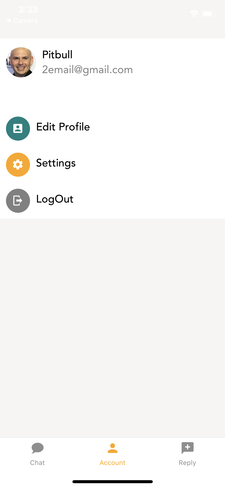

# MVP Story-Time

A React Native Application to share stories or chat with Friends! Build within a 2-day timeframe.

## Installation
Use the package manager [npm](https://www.npmjs.com/get-npm) to install all dependencies

## Usage
To run app: npm run start
